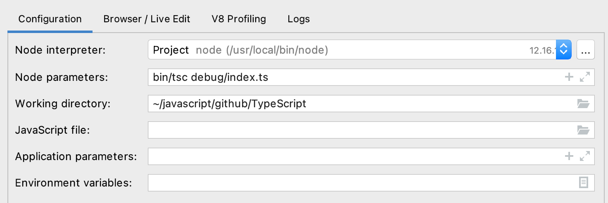

# 准备源码

[下载源码](https://github.com/jiangchenguang/TypeScript-v1.4-code-analysis)

# 安装依赖

`npm install`

# build

终端执行`jake local`，生成built文件夹

# IDE添加配置

### vscode

```json
{
    "version": "0.2.0",
    "configurations": [
        {
            "type": "pwa-node",
            "request": "launch",
            "name": "debug",
            "skipFiles": [
                "<node_internals>/**"
            ],
            "runtimeExecutable": "node",
            "args": [
                "bin/tsc",
                "debug/index.ts"
            ],
            "outFiles": [
                "${workspaceFolder}/**/*.js"
            ]
        }
    ]
}
```

### webstorm



实际命令就是`node bin/tsc debug/index.ts`。

# 开始Debug

在src/compiler/tsc.ts:137行添加断点，欢乐的Debug吧。

# 从Ts仓库下载

当然也可以从Ts仓库下载源码，并调试v1.4，但多一些操作：

1. 改用带sourceMap的tsc
2. 添加被编译文件
3. `jake local`报错

## 改用带sourceMap的tsc

也就是修改`bin/tsc`文件：

```bash
#!/usr/bin/env node
#require('./tsc.js')
require('../built/local/tsc');
```

## 添加被编译文件

添加`debug/index.ts`：

```tsx
var hello: string = 'world';
```

## `jake local`报错

如果报错（TypeError: Jake.createExec is not function），需要package.json中指定jake的版本号：

```jsx
"jake": "v8.0.1"
```
